# Hi 👋, I'm Sandesh Majhi

🎓 BCA Student from Nepal
💻 Aspiring Software Developer
🚀 Learning Java, Data Structures & Algorithms
🌱 Exploring Web Development & UI/UX
🎯 Building my skills one project at a time

---

## 👨‍💻 About Me

* 🎓 Currently pursuing **Bachelor of Computer Applications (BCA)**
* 💡 Passionate about programming and technology
* 🧩 Practicing **Data Structures & Algorithms** through LeetCode
* ☕ Currently focusing on **Java**
* 🌐 Exploring Web Development
* 🤝 Interested in coding projects and open-source collaboration
* 📚 Always learning and improving

---

## 🛠️ Tech Stack

### Languages


### Web Development


### Tools


---

## 📊 GitHub Stats





---

## 🧠 Currently Learning

```text
Java
 ├── OOP
 ├── Collections
 ├── Exception Handling
 └── Problem Solving

Data Structures & Algorithms
 ├── Arrays
 ├── Strings
 ├── HashMap
 ├── Linked List
 ├── Sliding Window
 └── Dynamic Programming

Web Development
 ├── HTML
 ├── CSS
 └── JavaScript
```

---

## 🚀 Current Focus

* ☕ Improving Java
* 🧠 Strengthening DSA
* 🧩 Solving LeetCode problems
* 🌐 Learning Web Development
* 🎨 Exploring UI/UX
* 🛠️ Building real-world projects

---

## 🎯 2026 Goals

* [ ] Solve 500+ LeetCode problems
* [ ] Build real-world projects
* [ ] Improve DSA and problem-solving skills
* [ ] Learn Full-Stack Development
* [ ] Contribute to Open Source
* [ ] Get a Software Development Internship

---

## 📂 Featured Projects

🚧 **Currently building my portfolio...**

More projects coming soon!

---

## 🌱 My Philosophy

> Learn → Build → Break → Fix → Repeat.

---

## 🤝 Let's Connect

I'm always interested in meeting fellow developers, students, and people who enjoy learning technology.

**Let's learn and build together! 🚀**

---

⭐ Thanks for visiting my profile!
